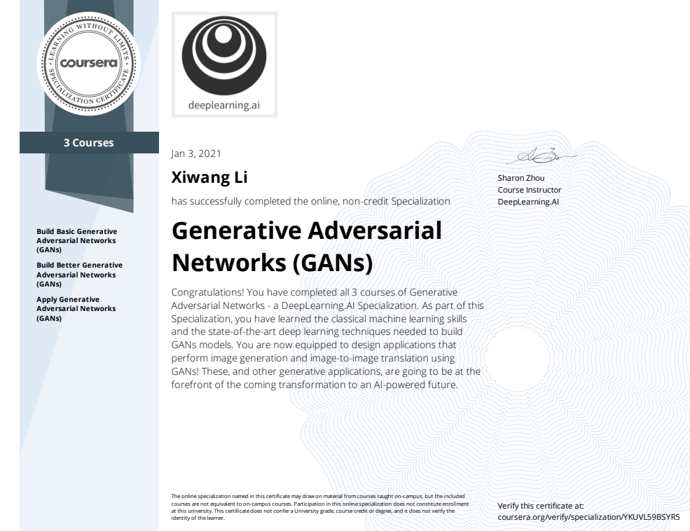

# Deeplearning-ai-GAN-Specialization

This repository contains all my work for [Deeplearning.ai GAN Specialization](https://www.deeplearning.ai/generative-adversarial-networks-specialization/). There are three courses in this specialization:
1. [Course 1: Build Basic Generative Adversarial Networks](./1-Build_Basic_Generative_Adversarial_Networks)
1. [Course 2: Build Better Generative Adversarial Networks](./2-Build_Better_Generative_Adversarial_Networks)
1. [Course 3: Apply Generative Adversarial Networks (GANs)](./3-Apply_Generative_Adversarial_Network(GAN))

# Certification
